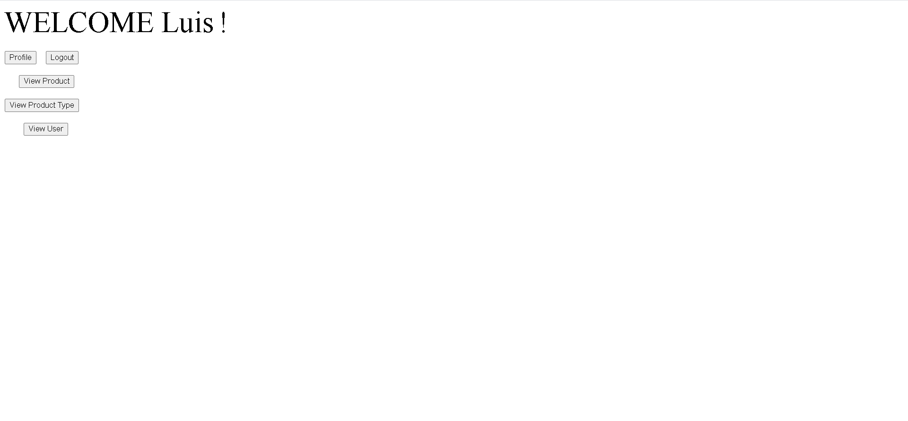
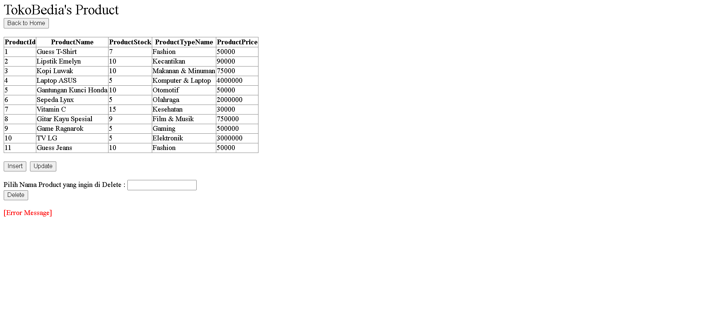

# TokoBedia Website
This is my school project in Pattern Software Design(or Domain Driven Design) Laboratory Subjects. This is an individual project. 
This project is about E-Commerce Website.

## Description
This project is made on March 24, 2020 during 4th semester  in university.  
The purpose of this project is to implement Domain Driven Design in the project, so there will be a view, repository, and factory folder.  
In this project, it emphasizes the functions that run well so that the design is not assessed in this project.

## Run Guide
Please run it from <b>Home1.aspx</b> in view folder.

## Project's Image Overview
First Image :

 
Second Image :

## Technologies
▸ C# 
▸ ASP.NET 
▸ Visual Studio 2015 
